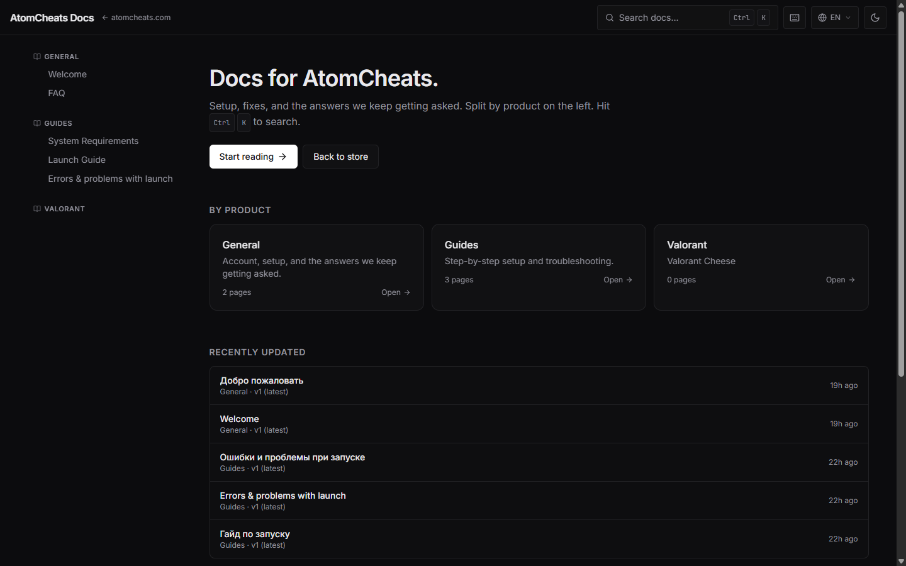
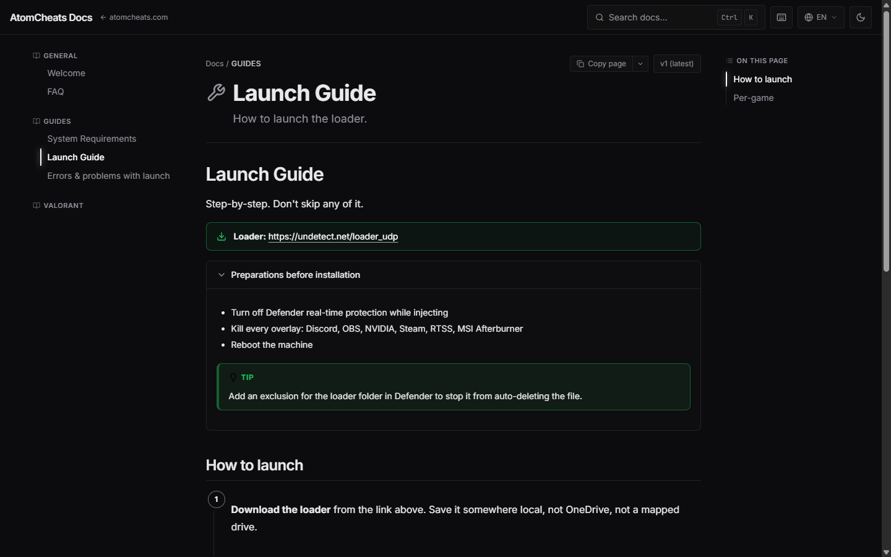
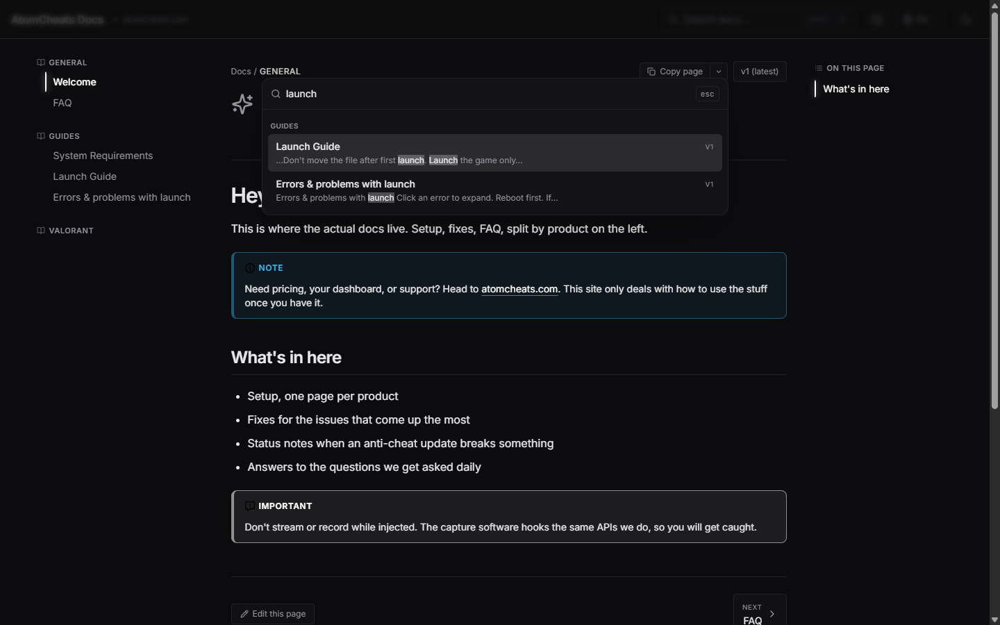
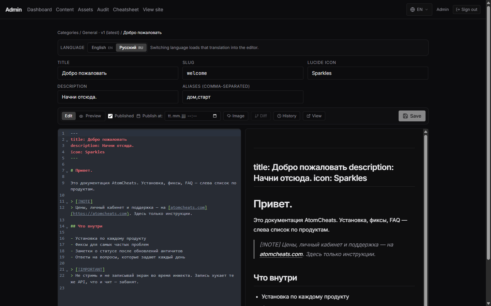

<div align="center">

# DocsWeb

**A self-hosted, GitBook-style documentation platform with a built-in CMS.**

Setup guides, fixes, and the answers users keep asking: all editable from the browser, no rebuilds.
Coded by Miracle Developer Studio.


</div>

---

## What it is

WebDocs is the documentation site that powers a product's help center. It looks
and reads like GitBook a multi-level sidebar, version switcher, instant search, dark/light
themes but everything is editable through an **in-browser admin panel**, so non-technical
editors can ship content without touching code or triggering a deploy.

Content is stored in a database as MDX and rendered server-side. When an editor saves a page,
the public site reflects the change within seconds.

> Built as a complete, production-grade app: authentication, a CMS, full content versioning,
> an audit log, search, SEO, and a one-command self-hosted deploy.

---

## Highlights

### Reading experience
- **Multi-level sidebar** with collapsible nesting, driven by the content tree
- **Version switcher** — keep `v1`, `v2`, … of the same docs side by side
- **Instant search** — a `Ctrl/Cmd + K` command palette with ranked snippet results
- **Dark & light themes** that persist across visits
- **Table of contents**, copy-as-Markdown, "view raw", and keyboard shortcuts
- Multi-language pages with a per-page language switcher

### Admin / CMS
- **Single-key login** — lightweight access control without a full user system
- **Categories → Versions → Pages** content model, fully CRUD-able from the UI
- **Drag-to-reorder page tree** with nesting (powered by dnd-kit)
- **CodeMirror 6 Markdown editor** with live MDX preview and image upload
- **Full revision history** — every save is versioned, with a diff viewer and rollback
- **Audit log** of who changed what, and when
- **Bulk import** of existing Markdown files

### Under the hood
- Server-rendered MDX with syntax highlighting, GitHub-flavored Markdown, and auto-linked headings
- Generated `sitemap.xml`, `robots.txt`, OpenGraph images, and OpenSearch descriptor
- Health-check endpoint and path-based cache revalidation on every edit

---

## Tech stack

| Layer        | Choice |
| ------------ | ------ |
| Framework    | Next.js 16.x (App Router) · React 19 · TypeScript |
| Styling      | Tailwind CSS 3.4 · shadcn-style components |
| Data         | Prisma 6 ORM |
| Auth         | Auth.js v5 — Credentials provider, JWT sessions |
| Content      | `next-mdx-remote` (RSC) · Shiki highlighting · `remark-gfm` |
| Search       | `cmdk` command palette + database-backed full-text search |
| Editor       | CodeMirror 6 with a live MDX preview pane |

---

## How content works

```
Category          e.g. "General", "Apex", "CS2"
  └─ Version       e.g. v1, v2 — one marked default
       └─ Page     MDX content, nested into a tree → drives the sidebar
```

Public URLs follow the shape `/<category>/<version>/<...slug>`. Editors manage the whole
tree from the admin panel; saves revalidate the affected paths so the live site updates
without a rebuild.

---

## Project layout

```
app/
  (docs)/      public documentation site
  admin/       browser-based CMS (auth-guarded)
  api/         auth handlers, search, content mutation endpoints
components/
  docs/        sidebar, topbar, TOC, search palette, MDX renderer
  admin/       login, category manager, page tree, MDX editor
lib/           database client, MDX pipeline, navigation tree, search
prisma/        schema + migrations
deploy/        container, reverse-proxy, and process-manager configs
```

---

## Screenshots

| Home | Documentation page |
| :--: | :----------------: |
|  |  |
| **Command-palette search** | **In-browser MDX editor** |
|  |  |

---

## Status

This repository is a **showcase**: the source code is kept in a private repository.
This page describes the architecture and feature set of the project.

Want a walkthrough or a live demo? Feel free to reach out.

---

<div align="center">
<sub> 1llusion.dev/miracle // frontend, CMS, database, auth, and deployment.</sub>
</div>
